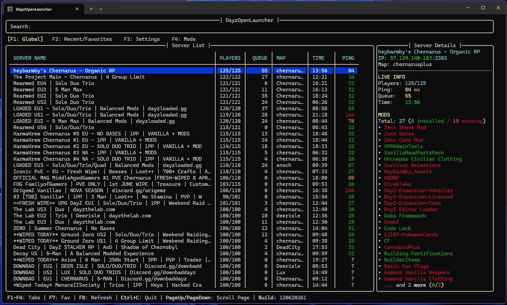

# DayzOpenLauncher

A simple Python TUI launcher for Windows Terminal that allows you to browse DayZ servers, manage favorites, settings, and mods.

## Features

- Browse DayZ servers using DZSA API.
- Manage favorite and recent servers.
- Live server info (players, queue, time, map, ping) via A2S.
- Automated mod synchronization support.

## Screenshots



## Requirements
- Windows 11 / 10
- Python 3.14

## How to use

1. Go to the [Releases](https://github.com/PawelKawka/DayzOpenLauncher/releases) page.
2. Download source code or clone this repo.
3. Open terminal in the repo directory.
4. Install python dependencies:
   ```bash
   pip install -r requirements.txt
   ```
5. Run the launcher:
   ```bash
   python Source/main.py 
   ```

> [!WARNING]
> #### Windows SmartScreen
> Because this project is free and open source the installer does not come with a digital certificate. Windows may display a SmartScreen message when you first run it.

## API

- Uses **DZSA API** for global server listing.
- Uses **python-a2s** for live server queries.

## About
- Developed by Pawel Kawka.
- Open Source and free to use.
